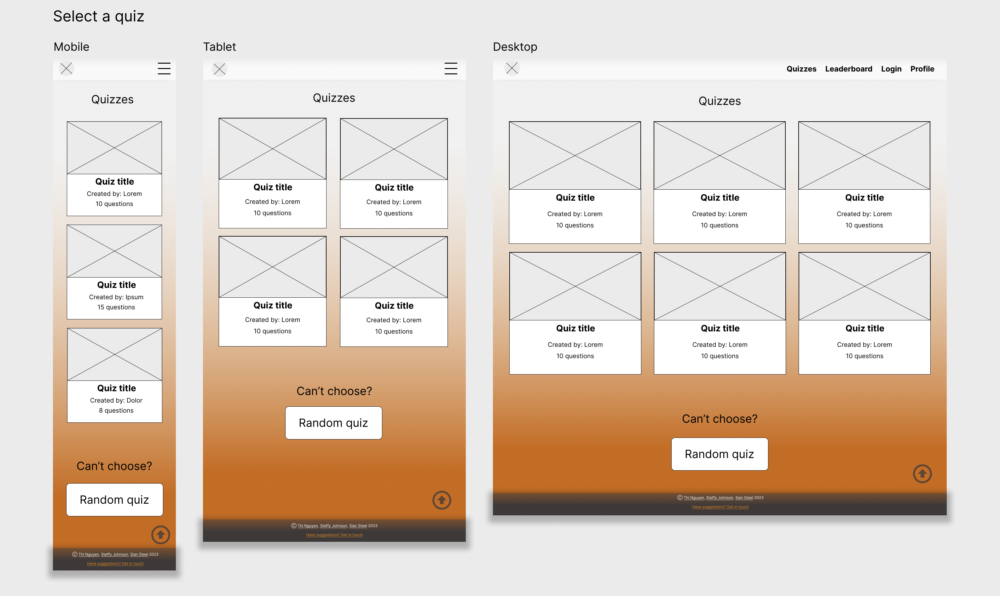
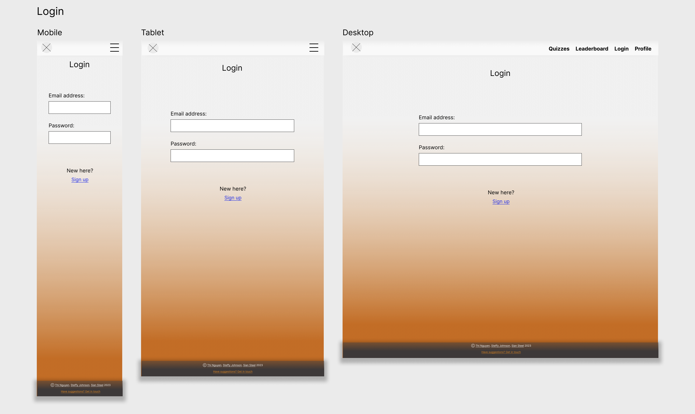
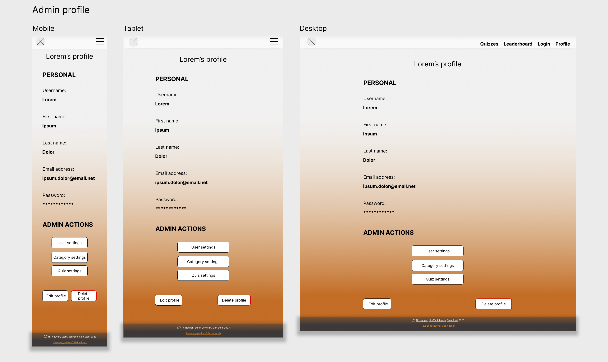

# T3A2 - Full Stack App - Quiz App

[Netlify Link]()
    
[github repo]()

[Youtube link]()

## PURPOSE
There are three main purposes of this application: 
1. The application's first purpose is an education tool to help people learn a fun way. Therefore, the application is an effort to encourage learning for all ages.  
   
2. To be used as a resource for teaching and assessment. This application is suitable to use in a classroom to make lessons interactive and interesting. Features such as creating new quizzes under different categories can make the learning experience more customisable.
   
3. At the end of the day, the application is a game, so it aims to entertain. The user/player can use it as a light-hearted way to wind down, or as a challenge to their friends.

## FUNCTIONALITY/FEATURES
MVP features and functionalities
* Take a quiz:  
  - Choose a category  
  - Choose a quiz  
  - Quit any time
  - See the quiz progress (i.e. question 5/15)
  - Skip to the next question before timer runs out
  - See total score at the end of the quiz 
  - See the correct and incorrect answers
  - Pop-up alert for high achievements
  
* Make a quiz:
  - Choose an exisiting category 
  - Create a new category
  - Specify the number of questions in a quiz
  - Add questions and answers
  - Save and exit when finished
  - Quit any time

* Edit a quiz:
  - Delete an entire quiz with all its questions and answers
  - Add, edit, delete questions
  - Add, edit, delete answers
  - Save and exit when finished

Nice-to-haves:
* Change timer duration for individual question
* User portal
  - Sign in
  - Edit user's information
  - Delete account
* Authorization 
  - Only registered users can create a new quiz 
  - Only admins and the quiz creator can edit or delete the quiz
* Sign up  
 - Sign up with a valid email address and password
* Leaderboard  
 - View users with high total points

## TARGET AUDIENCE
* Quiz enthusiasts who enjoy playing informational games and learning new things
* Students who want to practise knowledge learned in class or to prepare for a test
* Teachers who want a fun way to teach or to assess students' knowledge (i.e. homework and tests)

## USER STORIES
## STAGE 1
### TARGET AUDIENCE :

<strong>1. General Users of Quiz App</strong>

* As a general user of the quiz app, I want to be able to play fasinating quizzes.
* As a general user of the quiz app, I want to be able to explore quizzes from various quiz categories.
* As a general user of the quiz app, I want to be able to create new quiz questions for existing categories.
* As a general user of the quiz app, I want to be able to create new quiz categories and questions for the new category of the quiz.

<strong>2. Quiz enthusiasts</strong>

* As a quiz enthusiast, I want to be able to play quizzes to enhance my knowlege on various subjects to prepare for quiz competitions.
* As a quiz enthusiast, I want to be able to share my quiz knowledge with other collegues who are interested in quizzes by creating new quiz questions.

<strong>3. Students</strong>
 

* As a student, I want to be able to play quizzes to practice knowledge learned in class or to prepare for a test.
* As a student, I want to be able to create new quiz questions for existing categories which can help other students.

<strong>4. Teachers</strong>

* As a teacher, I want to be able to create new quiz questions for my class students to study and revise their lessons. This will help the students to  achieve better scores in exams.

   
## STAGE 2
### USER PERSONAS :
To better understand our target audience User Personas were created so that we could learn more about the goals and needs of our users. The below details were consolidated upon consulting with the the target audience on their goal and experiences in achieving their goals. 

#### Quiz enthusiasts
  
Goals :
- Being a quiz enthusiast, I am always looking for every opportunity to learn new things and practice my knowledge.
- I always want to challenge myself and have constant checks on my knowledge level.
- I always wanted to exhibit my knowledge on various subjects by creating Quiz an challege others.
- It is always exhilarating to compete against other quiz enthusists.

Challenges :
- It has been very difficult to get a proper application where I can do my practice quiz and check my level of knowledge.
- There are very less options currently available where I can create my own quizzes.  

#### Students 
  
Goals :
- As a student, I am always keen to gain my knowledge on various school subject and also revise as part exam prep.
- It is great to have a place where I can compete with the schoolmates and be the best.
- It would be great to have an application where my teacher can set quizzes for me and this gives an opportunity for me to evaluate myself.

Challenges :
- The knowledge i get from books are usually tested during exams, the absense of a proper way to test my knowledge regularly, affects my learning and revision. 
- Showcasing my knowledge and what I have learned from the classes to my teachers are currently only through the periodic exams and assignements.
  
#### Teachers 
  
Goals :
- As a teacher, I am always curious about my students learning curve. 
- I am looking for a platform where I can set up regular challenges and quiz which can help my student in their learning.
- It is always great to have a place where I can have a constant check if my students are imrpving themselves. 

Challenges :
- Other that periodic exams and assignments, it is never possible to evaluate my students learning curve.
  

### USER STORY : Application Architecture Diagram (MVP)

Create a visual representation of the various components, modules, and interfaces that make up a software application and how they interact with each other. The AAD will include elements such as the user interface, business logic, data storage, and external systems and services.

### USER STORY : Create Wire frame (MVP)

Create a low-fidelity, visual representation of a user interface (UI) design, typically used during the early stages of the design process. The wireframe will be a simple, blueprint-like representation of the layout and functionality of a website or application, showing the placement of elements such as text, images, and buttons

### USER STORY : Environment setup (MVP)

Setting up the environment for project. Including the git repo, installing the dependecies etc.

### USER STORY : Log-in

* As a user, I want to have the ability to login to the Quiz application by passing my username and password.
* As a user, I want to have the ability to be denied access to the Quiz application when I try to login with incorrect credentials.

### USER STORY : Route:Quiz Data Preparation (MVP)

Prepare the initial data for the quiz application for testing purposes.

### USER STORY : Route:Take a Quiz (MVP)

* As a user, I want to be able to explore multiple categories of quizzes
* As a user, I want to have the ability to take quizzes from any chosen category.
* As a user, I want to have the ability to see the time countdown for completing each quiz question.
* As a user, I want to have the ability to submit each questions before the time countdown completes.
* As a user, I want to have the ability to have the quiz questions to be submited automatically when the time countdown becomes zero.
* As a user, I want to have the ability to see the result of the quiz attempt.

### USER STORY : Route:Create Quiz Category

* As a user, I want to have the the ability to create new quiz category.
* As a user, I want to have the ability to upload a category image to set against the new quiz category created.

### USER STORY : Route:Create Quiz Questions

* As a user, I want to have the ability to create new quiz questions for existing categories.
* As a user, I want to have the ability to create new quiz questions for new categories created.

### USER STORY : Route:Quiz Leaderboard & Stats

* As a user who has logged in, I want to have the ability to view the leaderboard and stats of my quiz performance.

### USER STORY : Pop up messages for Quiz wins

* As a user, I want to have the ability to get badges or pop messages as a way to celebrate the winning of quiz challenge.

## Dataflow diagram

## Application Architecture Diagram

## Website design

### Site aesthetics

For the colour scheme we chose orange, black and white as the main colours. Orange is associated with energy, optimism and excitement. The quiz application is primarily aimed at a young audience and those who like to play quizzes for fun, using a bright colour like orange conveys the message that the app is a fun environment to learn in and challenge yourself. However the design is still stylish, to appeal to all ages.

The majority of text on the website is black text on a white background which is a very high contrast ratio (21:1) and therefore easy to read at most sizes. The next most common text is black text on a dark orange background, which according to Adobe's colour accessibility tools is also a high contrast ratio (6.21:1) and clearly readable at most sizes.

Coblis, a free online tool at color-blindness.com, was used to see how the website would look for people with the most common colour blindness - red/green. The text still maintained a high contrast against the background colours and was still easy to read.

We kept the styling and layout quite simple, with most screens prompting the user to click on a button or object in the centre of the screen to progress. Both symbols and words were used to convey the action the user should take, making the app simple to navigate, especially for younger users.

## Sitemap

The sitemap shows the layout of the website when navigated by a general user. The main menu items 'Quizzes', 'Leaderboard', 'Login' and 'Profile' allow movement between the main features of the application. 'Quizzes' contains the dropdown menu items 'Categories' for viewing a list of categories and then the quizzes within whichever category is selected. 'Login' contains a dropdown menu item called 'Sign up' which leads to a form which allows new users to create an account. This page is also accessible from the login page should a new user go here instead.

## Wireframes

### Home page

The home page will display a large image or logo with the name of the app as well as having some featured quizzes to encourage the user to click on a quiz and get started with using the app straight away. The site is easy to navigate with a menu bar that scrolls up and down with the user. On the far left side of the menu bar is a clickable logo that allows the user to return to the home page. The bottom menu bar is fixed to the bottom of the page and contains copyright information as will as a link to contact us with any suggestions for improvements.

### Quiz categories

This page is navigated to by using the sub menu button 'Categories' under the 'Quizzes' menu. It displays a list of categories for the user to select from. The buttons are large and white in the centre of the screen with one category per line to allow the user to easily scroll through and select. On long scrolling pages like these, an arrow button will be shown in the bottom corner of the screen to allow the user to easily return to the top. The button is translucent so that it does not obscure any information that may end up underneath it. At the bottom of the page a button can be clicked to pick a random category if they cannot decide.

### Quizzes

The quizzes page displays either all quizzes or those within a selected category, depending on the users actions. Each quiz will be displayed within a box with an image, the title, who made it and how many questions it has. The boxes can be clicked on to begin the quiz. The number of quizzes displayed is determined by the size of the screen, with the user scrolling down to reveal more. At the bottom of the page a button can be clicked to start a random quiz if they cannot decide.

### Taking a quiz

The quiz screen will display a question, an optional image and four answers to choose from with the timer counting down on screen. The user can quit at any point and also select the next button to move on to the next question if they have answered before the timer is up.

### Quiz result

The result page shows how many answers the user got correct and may display a celebratory image or icon if they get a high score. They can then review their answers to see which ones they got correct or incorrect.

### Make a quiz

The make a quiz page is a form to allow users to make their own quiz and add it to an existing category or create a new one. Clicking the 'next' button will allow them to add questions to the quiz.

### Add questions

The add questions page allows users to add, edit and delete questions within their quiz. They can quit at any time or go back to the previous 'make a quiz' page.

### Edit a quiz

Quizzes can be edited or deleted from this page. Users can scroll down to find the quiz they want and choose whether to edit or delete it using the buttons. If they choose to edit it will lead back to the 'make a quiz' and 'add questions' pages.

## Wireframes for non-MVP features

### Leaderboard

The leaderboard will display a list of users with their usernames and their scores in order, with those with the highest scores at the top of the page.

### User login

The user login page prompts the user to enter their email address and password to sign in. If a new user visits this page there is a link to take them to the sign up page.

### User sign up

The sign up page is a form which takes the users information and is used to create their profile. At this point if the user decides they want to sign up later, they can press the 'back' button and go to the home page. Or once they have filled in the form they can press the 'save profile' button and they will be sent to their profile page.

### User profile

The user profile will show the information relating to the user who is signed in including their personal details as well as their quiz statistics. There are buttons on the page to allow the user to edit or delete their profile.

### Admin profile

The admin profile contains the same personal details and buttons to edit or delete as the user profile but without the quiz statistics. Instead an additional section only visible to admin users contains buttons which allow them to view, edit or delete users, categories and quizzes.

### Admin - select a user

A page only accessible to admin users, where they can select a user to view, edit or delete. The unique user ID, username and email address are displayed for each user to help the admin select the correct one.

### Admin - edit/delete a category

A page only accessible to admin users, where they can edit or delete a category. This option is only available for admin users as deletion of a category would deleted all quizzes within that category. If they change their mind they can use the 'quit' button to go back to the list of categories.

## Trello screenshots

## TECH STACK
### Front-end
* HTML
* CSS
* JavaScript
* React
### Back-end
* Express
* Node.js
### Object Data Modeling
* Mongoose
### Database
* MongoDB
### Deployment 
* Netlify
* Railway
### Project Management Tools
* Trello
* Google Docs
* Discord
### Testing
* Vitest
* Jest
### DevOps
* git
* GitHub
* Visual Studio Code
### Design Tools
* Figma
